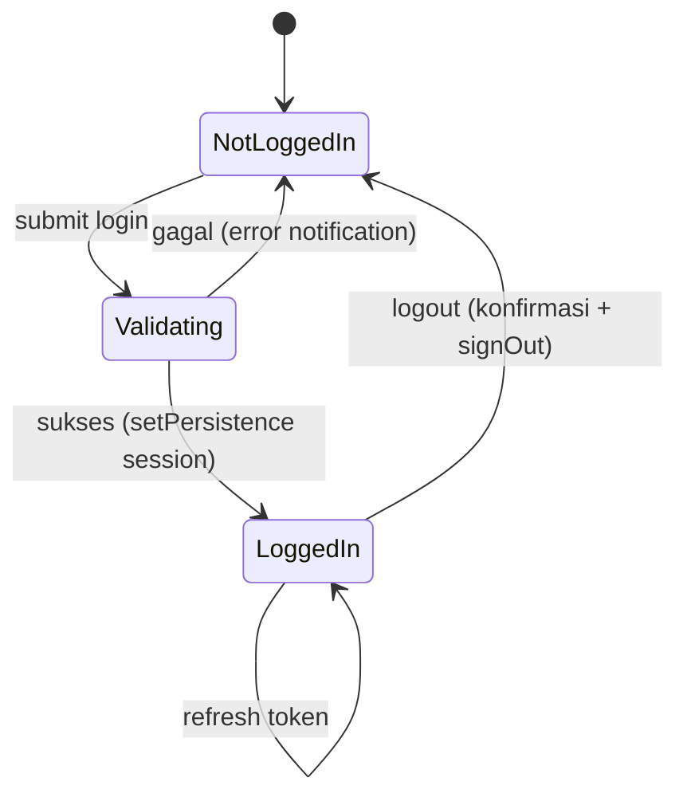
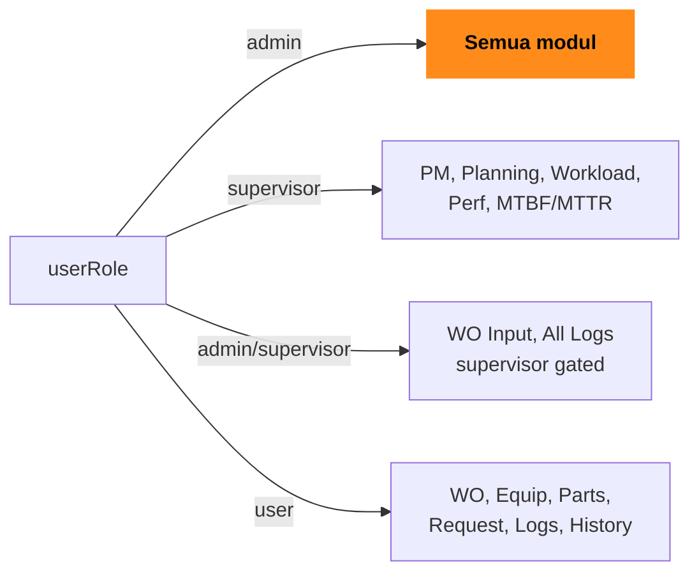
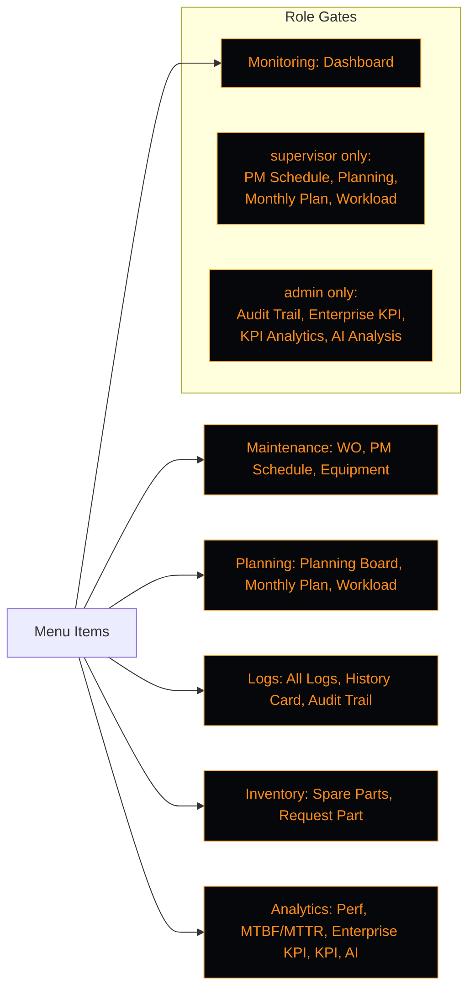

# MTC-ASSET — Flowchart Aplikasi

Diagram alur utama: startup, autentikasi, kontrol peran (RBAC), dan navigasi modul.

## 1. Flowchart Utama (Startup → Login → Dashboard)

```mermaid
flowchart TD
    START([Browser Buka App]) --> INIT["Kickoff Bootstrap<br/>bootstrap.js init()"]
    INIT --> THEME["Apply Theme<br/>data-theme = localStorage<br/>(default dark)"]
    THEME --> AUTHOBS["Firebase onAuthStateChanged<br/>pantau sesi"]
    AUTHOBS --> CHECK{User sudah login?}
    CHECK -- No --> LOGIN["Tampil Login Screen<br/>System Access"]
    LOGIN --> LOGINFORM["Input Authentication ID +<br/>Secure Key (Firebase Auth)"]
    LOGINFORM --> VALID{Valid?}
    VALID -- No --> LOGINERR["Notification: Login failed"] --> LOGIN
    VALID -- Yes --> ROLE["checkUserRole(uid)<br/>set userRole"]
    CHECK -- Yes --> ROLE

    ROLE --> ROLE_BRANCH{Role apa?}
    ROLE_BRANCH -- admin --> ADMIN["AKSES PENUH<br/>semua menu + AI + Audit"]
    ROLE_BRANCH -- supervisor --> SUP["Supervisor<br/>tanpa Audit/AI/Foreign"]
    ROLE_BRANCH -- user --> USR["User<br/>menu dasar + WO + parts"]

    ADMIN --> LOAD["setupFirebaseListeners<br/>loadPMSchedule<br/>loadAISettings"]
    SUP --> LOAD
    USR --> LOAD
    LOAD --> DB["Baca data dari Firebase<br/>(Equipment, WO, Parts, Performance)"]
    DB --> DASH([Dashboard]<br/>card + chart + panic stat)
    DASH --> NAV["Navigasi sidebar / bottom-nav<br/>berdasarkan canAccess"]
```

## 2. Login & Logout



## 3. Role-Based Access (RBAC)



## 4. Modul Menu per Grup



> [!NOTE]
> Akses dikontrol fungsi `canAccess(item)` di [app.js](file:///d:/Coding/MTC-Asset/src/js/app.js): `allowedRole` `undefined`=all, `admin`=admin-only, `supervisor`=admin+supervisor.

## Rendering

- Salin blok ```mermaid``` ke editor yang mendukung (VS Code + Mermaid, mermaid.live, atau GitHub).
- Styling pakai `classDef` Mermaid.
